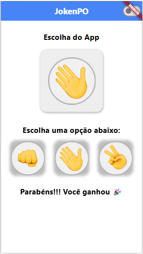

# 📱 Flutter JokenPo

## 🚀 Sobre o Projeto

**Flutter JokenPo** é um jogo mobile interativo e leve, desenvolvido com **Flutter**, inspirado no clássico jogo **Pedra, Papel, Tesoura**. O aplicativo oferece uma experiência de usuário suave, com uma interface limpa, jogabilidade baseada em IA e randomização, e animações fluidas.

### Principais Características:

- **Lógica de Jogo em Tempo Real**: Determina instantaneamente o vencedor após cada jogada, garantindo uma experiência de jogo rápida e dinâmica.
- **Oponente de IA Aleatório**: Utiliza a classe `Random()` do Dart para gerar movimentos imprevisíveis controlados pelo computador.
- **UI/UX Suave**: Construído com o Material Design do Flutter, oferecendo uma interface moderna, fluida e responsiva.
- **Suporte aos Modos Claro e Escuro**: O aplicativo se adapta automaticamente ao tema do dispositivo, proporcionando uma experiência de usuário mais agradável.
- **Leve e Rápido**: Otimizado para baixo consumo de memória, garantindo um desempenho suave em diferentes dispositivos.
- **Replay Anytime**: Reinício instantâneo do jogo após cada rodada, permitindo jogabilidade contínua sem interrupções.

O principal objetivo do **Flutter JokenPo** é proporcionar uma experiência de jogo divertida e envolvente, ao mesmo tempo em que explora as funcionalidades essenciais do Flutter, como gerenciamento de estado, randomização e design responsivo da interface do usuário.

## 📋 Requisitos

- **Plataforma**: Android 5.0+ / iOS 12+ / Web
- **Ferramentas**: Flutter SDK 3.10+ / Dart 3.0+
- **Editor**: Recomendado: VS Code ou Android Studio
- **Conexão com a Internet**: Não é necessária para a jogabilidade básica

## 🛠 Tecnologias Utilizadas

- **Idioma**: Dart
- **Estrutura**: Flutter
- **Gerenciamento de Estado**: `setState()` (utilizado para atualizações da interface)
- **UI & Design**: Flutter Material Design, com suporte ao Modo Escuro
- **Randomização**: Classe `Random()` do Dart para gerar movimentos do oponente de IA
- **Compatibilidade de Dispositivos**: Android, iOS e Web

## 🖼 Captura de Tela  

  

  

## 🎥 Demonstração em GIF  

  

## 🎯 Objetivos de Aprendizagem

Durante o desenvolvimento do **Flutter JokenPo**, diversos conceitos técnicos foram aplicados e aprimorados, como:

- **Lógica de IA Aleatória**: Utilizando a classe `Random()` do Dart para gerar um comportamento imprevisível no jogo.
- **Gerenciamento de Estado**: Usando `setState()` para atualizar dinamicamente a interface do usuário após cada jogada.
- **Componentes de UI do Flutter**: Criando uma interface interativa e responsiva com os widgets do Material Design.
- **Desenvolvimento Multiplataforma**: Garantindo compatibilidade entre Android, iOS e Web.
- **Otimização de Desempenho**: Mantendo o aplicativo leve e rápido, proporcionando uma jogabilidade suave e responsiva.

**Flutter JokenPo** foi desenvolvido para oferecer uma experiência de jogo rápida, divertida e intuitiva para todos os usuários, seja no Android, iOS ou na web!

